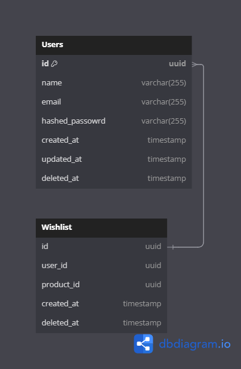
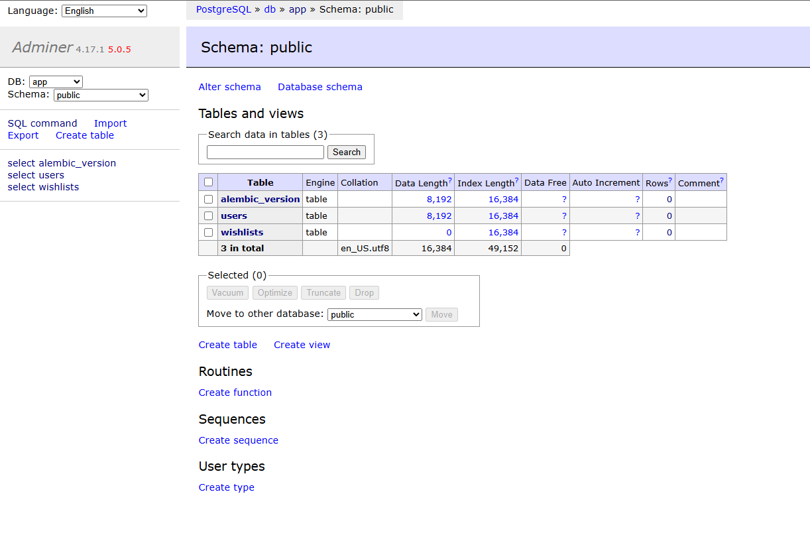

# MagaWish (FastApi Coding Test)

## Index

- [Introduction](https://github.com/PedroKruszynski/MagaWish#introduction)
  - [Principal Technologies](https://github.com/PedroKruszynski/MagaWish#principal-technologies)
  - [Application Dependencies](https://github.com/PedroKruszynski/MagaWish#application-dependencies)
  - [Build Docker Image](https://github.com/PedroKruszynski/MagaWish#build-docker-image)
  - [Run Migrations](https://github.com/PedroKruszynski/MagaWish#run-migrations-required)
  - [Create Migrations](https://github.com/PedroKruszynski/MagaWish#create-migrations)
  - [Run Docker Containers](https://github.com/PedroKruszynski/MagaWish#run-docker-containers)
  - [Running Tests](https://github.com/PedroKruszynski/MagaWish#running-tests)
  - [Gen Coverage](https://github.com/PedroKruszynski/MagaWish#gen-coverage)
- [API Endpoints](https://github.com/PedroKruszynski/MagaWish#api-endpoints)
- [Database EER](https://github.com/PedroKruszynski/MagaWish#database-err)
- [Architecture](https://github.com/PedroKruszynski/MagaWish#Architecture)
  - [Infra Folder](https://github.com/PedroKruszynski/MagaWish#infra)
  - [Modules Folder](https://github.com/PedroKruszynski/MagaWish#modules)
  - [Shared Folder](https://github.com/PedroKruszynski/MagaWish#shared)

## Introduction

That application was developed for an challenge from LuizaLabs. Using Python + FastApi
The Objective are create a api for a system of wishlist.

Here’s the README with the principal technologies, formatted similarly to your example:

### Principal Technologies

- [Python:3.12](https://www.python.org/downloads/release/python-3120/) - Python
- [FastAPI:0.114.2](https://fastapi.tiangolo.com/) - FastAPI
- [Pydantic:2.0](https://pydantic-docs.helpmanual.io/) - Pydantic
- [PostgreSQL:14](https://www.postgresql.org/) - PostgreSQL
- [Redis:4.3.4](https://redis.io/) - Redis
- [SQLAlchemy](https://www.sqlalchemy.org/) - SQLAlchemy ORM
- [Alembic:1.12.1](https://alembic.sqlalchemy.org/en/latest/) - Alembic
- [Docker](https://www.docker.com/) - Docker
- [Docker Compose](https://docs.docker.com/compose/) - Docker Compose

### Application Dependencies

You have to copy the '.env.example' file and rename to '.env'

``` bash
cp .env.example .env
```

### Build Docker Image

After create the .env file you can run these following commands to build the image.

``` bash
# Build all images for the app and run the containers
docker compose up -d --build
```

### Run Migrations *Required*

To run the migration you need to run this command

``` bash
# This command will run a container run the migrations and remove ther container after finish
docker compose run --rm app alembic upgrade head
```

### Create Migrations

To create a migration use this command

``` bash
# Create a migrations
docker compose run --rm app alembic revision -m "name of migrations goes here"
```

### Run Docker Containers

To run all the containers after run the migrations, just run the command

``` bash
# Run all containers
docker-compose up -d
```

### Running Tests

The test are build with pytest, just run these command to run all tests

``` bash
# Run all tests of the application
$ docker compose run --rm app pytest
```

### Gen Coverage

Gen the coverage you must run three commands

``` bash
# Run all tests
$ docker compose run --rm app coverage run --source=maga_wish --data-file=/app/coverage_data/.coverage -m pytest

# Gen coverage report
$ docker compose run --rm app coverage report  --data-file=/app/coverage_data/.coverage --show-missing

# Gen HTML report
docker compose run --rm app coverage html --data-file=/app/coverage_data/.coverage -d /app/coverage_data/html
```

Will generate a folder with the name coverage_data, inside you will see a html/index.html, just open it.

## API Endpoints

You have two ways to view all available endpoints:

1. **Swagger UI** – Open `/docs` in your browser to explore the API interactively.
2. **Postman Collection** – Navigate to `/docs/postman` to download the JSON file and import it into Postman.

## Database EER 

EER - Enhanced Entity Relationship



You can view the database diagram script [here](./docs/database/dbdiagram.io.sql.sql) or open it online using this link: [dbdiagram.io](https://dbdiagram.io/d/MagaWish-67d4ca4375d75cc844282a27).

## Adminer

Adminer is available for internal database management at http://localhost:8080. This tool allows you to manage and interact with the database directly.



## Architecture

### Infra

- **Alembic** folder is the migrations folder.

### Modules

- Modules for each **domain** of api;

- Each module have a **DTO** telling what is the data of the function;

- **Infra** folder with the sqlAlchemy **Repositories** and **Entities**, a **http** folder containing the **Controller** and **Routes** of api;

- **Services** folder contain all services of the module.

### Shared

- **Infra** folder are for the **Http** folder, that fold define all **Routes** and start the api server; also have a redis and a sqlAlchemy;

- **Environment** folder is the configuration of the project.

### Thank you! :)

For doubts email me `pedrokruszynski@gmail.com`.
